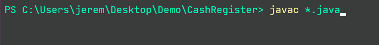

# Cash Register Simulator

A cash register simulator that uses an interactive menu to allows users to:

- Upload items via plain text files
- Purchase items 
- Checkout customers

The program also generates a receipt file upon checkout.

#### To Build:
Download the java source code and run the following command in the same directory:
```
javac *.java
```

#### Run:
```
java CashRegisterDriver
```

